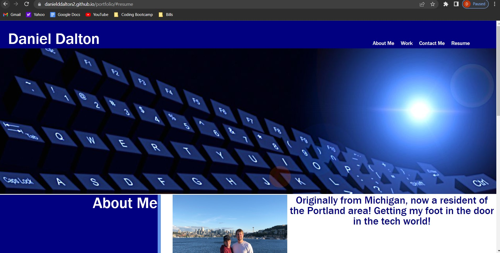

# Portfolio (Module 2 Challenge)
My professional portfolio.
## Description

Creating a portfolio of work can showcase your skills and talents to employers looking to fill a part-time or full-time position.

## Table of Contents (Optional)

N/A

## Installation

Github pages hosting: https://danielddalton2.github.io/portfolio/

## Usage

## Credits

Keyboard image, resume image and contact me image all taken from Google Images.

## License

Please refer to the LICENSE in the repo.